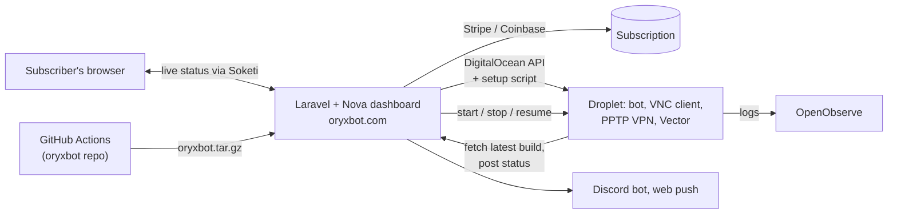

# oryxbot-web

Laravel platform behind oryxbot.com: accounts, subscriptions, one-click bot servers and a live dashboard for the OryxBot Albion Online bot.

## What it is

- The web side of [oryxbot](https://github.com/kpolicar/oryxbot): marketing site, sign-up and billing, plus a Laravel Nova dashboard where each subscriber sets up and remote-controls their own bot instance.
- It provisions the bot's infrastructure for the user: a DigitalOcean droplet in their own account, pre-configured with the bot, a VNC client, a VPN server and log shipping.
- It is the message bus between bot and browser: the bot reports position, current step and status over an encrypted API; the dashboard streams that live and sends start, stop and resume commands back over WebSockets.

## Background

- Albion Online (Sandbox Interactive, 2017) is a free-to-play sandbox MMORPG with a player-driven economy and full-loot PvP zones.
- Faction "transport missions" haul cargo between the game's cities for faction hearts and silver: profitable, but slow and repetitive. OryxBot automated them; this repo (2020–2024) is the product built around that bot.

## How it works

- **Accounts and billing.** Laravel Fortify auth with email verification, Stripe subscriptions via Cashier (free trial, promo code), Coinbase Commerce for crypto, referral codes, localised routes.
- **Instance setup.** A wizard validates the user's DigitalOcean token, creates a small Ubuntu droplet and injects a generated script (`server-setup.sh`) that installs the .NET runtime, Java for the VNC client, a PPTP VPN server, `xdotool`, supervisor and Vector. `server-startup.sh` then pulls the latest bot build and `VncClient.jar` from this app with a Passport token and starts the bot under supervisor.
- **Live control loop.** The bot POSTs to `/api/v2/instance/{slug}/data/*` (moved, step changed, status, remote desktop, client version). Laravel rebroadcasts these as private-channel events through Soketi to the browser; dashboard actions (start with city and heart count, stop, resume, record a route) go back the same way, and a service restart runs over SSH.
- **Notifications and logs.** Run started, completed or stuck fans out to Discord and OneSignal web push. A Discord bot links Discord accounts (`!login email`) and grants roles. Each droplet ships bot logs via Vector to a shared OpenObserve instance with per-user credentials.
- **Releases.** `POST /deploy/oryxbot` (bearer-protected) receives the tarball from the oryxbot repo's CI; `/storage/releases/latest` serves it to droplets; release-notes pages track v0.1 beta through v2.0.

## Tech stack

- PHP 7.4, Laravel 8, Laravel Nova (custom theme and tools), Passport, Cashier, Fortify, Telescope, Blade with Tailwind, Vue 2 for Nova tools, Laravel Mix.
- PostgreSQL, Soketi (Pusher protocol) with Laravel Echo, OpenObserve and Vector, Postmark mail, OneSignal, discord-php, DigitalOcean API, phpseclib SSH.
- Docker Compose (php-nginx image with supervisor for the queue worker and Discord bot, Soketi, OpenObserve) behind a Caddy reverse proxy; earlier Travis CI deploys over SSH.

## Repository layout

- `app/` — models (`User`, `Subscription`, `Instance`, `Server`), controllers (Stripe, Coinbase, DigitalOcean, BotDataApi, Deployment, Ssh), broadcast events.
- `nova-components/` — dashboard tools: `OryxbotInstance` (control panel), `OryxbotHelp`, a custom theme, and `OryxbotLogs` / `OryxbotInsights` placeholders.
- `discordapp/` — standalone Discord bot process.
- `server-setup.sh`, `server-startup.sh`, `vector.yaml` — templates injected into each droplet.
- `docker-compose.yml`, `docker/` — production stack.

## Running it

Standard Laravel 8 app: `composer install`, copy `.env.example` to `.env`, `php artisan migrate`, `npm run dev`. Production runs from `docker-compose.yml`.

## Status and related

- Last commit May 2024. Built for the legacy bot client on the `prod` branch of [oryxbot](https://github.com/kpolicar/oryxbot); the 2026 rebuild there ships its own static site and does not use this backend.
- Personal project by Klemen Poličar; proprietary license (see `LICENSE`). Not affiliated with Sandbox Interactive; Albion Online is their trademark.
