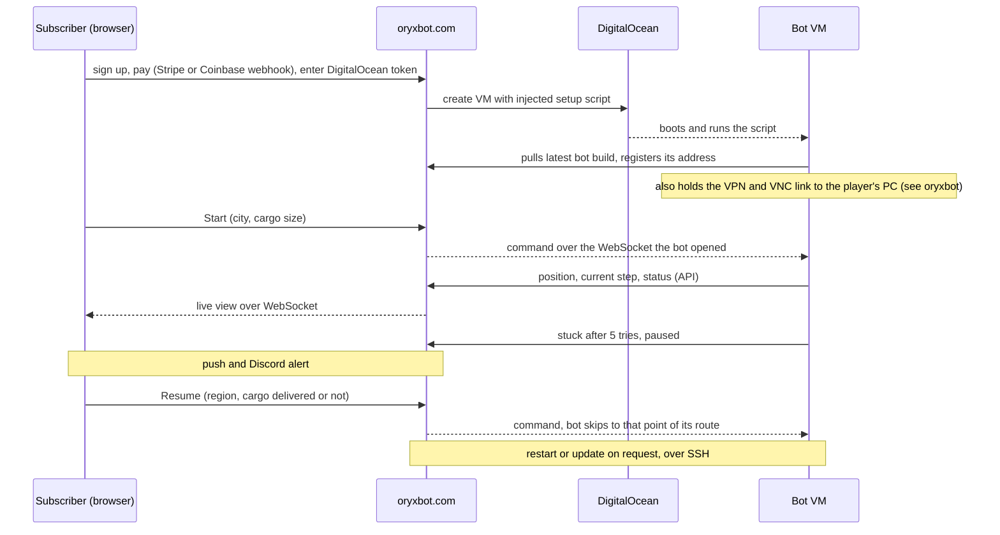

# oryxbot-web

The web platform that sold subscriptions to OryxBot, a bot for the online role-playing game Albion Online, and provisioned and remote-controlled each subscriber's bot server.

## What it is

- The product around the bot: sign up, pay by card or crypto, click once to get your own bot server, then watch the bot live and steer it from a dashboard.
- One-click infrastructure in the customer's own cloud account: the app creates a DigitalOcean VM with an injected setup script, and the VM pulls the bot from the app and reports back. The player's PC keeps running the game and tunnels to that VM.
- 8 release-note pages from v0.1 beta (March 2021) to v2.0 (April 2024): v1.0 moved the bot off the player's PC onto a server, v2.0 gave each subscriber their own VM. Laravel 8 with a Laravel Nova dashboard, built for the sibling repo's `prod` client.

## Background

- Albion Online (Sandbox Interactive, 2017) is a free-to-play sandbox MMORPG built around a player-driven economy and open-world PvP.
- Its in-game delivery quests (haul cargo from city to city for currency) are profitable but slow and repetitive; the bot ran them on a loop, and this platform put a human back in the loop when it got stuck.

## How it works

- **Accounts and billing.** Email sign-up, Stripe subscriptions with a free trial and promo codes, Coinbase Commerce for crypto, referral codes.
- **One-click bot server.** The setup script installs the bot, a VPN server and a VNC client; the VM then pulls builds from this app, and the only inbound path is SSH, used by the restart button to update and relaunch. The player's PC needs a VNC server and a Windows VPN connection, checked from their browser.
- **Live relay.** The bot posts to an authenticated API (bodies also AES-wrapped); Laravel rebroadcasts to the browser over WebSockets. Commands go the other way on a channel the bot opens itself, which also carries its log lines back.
- **Human in the loop.** Routes were recorded per city and cargo size picks the quest contract, so Start needs both. When the bot gives up (five stuck attempts in thirty seconds) it pauses and alerts; Resume asks which region it is in and whether cargo was delivered, then skips to that point of the route.
- **Releases and logs.** The oryxbot repo's CI posts each build to a bearer-protected endpoint here and VMs download it from the app. Each VM also ships bot logs to a shared OpenObserve instance; Discord and web push carry started / completed / stuck alerts.

## Tech stack

- PHP 7.4, Laravel 8, Laravel Nova (custom theme and tools), Passport, Cashier, Fortify, Telescope; Blade with Tailwind, Vue 2 for the Nova tools, Laravel Mix.
- Soketi (Pusher protocol) with Laravel Echo, PostgreSQL on the host, OpenObserve and Vector for logs, Postmark, OneSignal, discord-php, DigitalOcean API, phpseclib SSH.
- Docker Compose (php-nginx with supervisor for the queue worker and Discord bot, Soketi, OpenObserve) behind a Caddy reverse proxy; earlier Travis CI deploys over SSH.

## Repository layout

- `app/Http/Controllers/DigitalOceanController.php` with `server-setup.sh`, `server-startup.sh`, `vector.yaml` — provisioning and the scripts injected into each VM.
- `app/Http/Controllers/BotDataApiController.php`, `app/Events/` — the bot-to-browser relay.
- `nova-components/OryxbotInstance/` — the dashboard control panel (Vue); `OryxbotLogs` and `OryxbotInsights` are placeholders.
- `discordapp/` — the Discord bot process (account linking, alerts).
- `docker-compose.yml`, `docker/` — the production stack.

## Running it

Standard Laravel 8 app: `composer install`, copy `.env.example` to `.env`, `php artisan migrate`, `npm run dev`. Production runs from `docker-compose.yml` with PostgreSQL on the host.

## Related

- [oryxbot](https://github.com/kpolicar/oryxbot) — the bot this platform deployed (its `prod` branch); that README shows the VPN and VNC internals between the VM and the player's PC.

## Status

Last commit May 2024; the 2026 oryxbot.com site is a static SPA that does not use this backend.
Personal project by Klemen Poličar; proprietary licence (see `LICENSE`). Not affiliated with Sandbox Interactive; Albion Online is their trademark.
